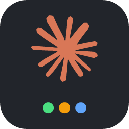

# Claude Session Tabs

Chrome-style tab management for the **Claude Code** VS Code extension: named + colored **groups**, a searchable session list, pinning, and a **rich hover preview** showing each session's last messages, git branch, token usage, and activity — the stuff Chrome gives you on tab hover, brought to your Claude Code conversations.

> **Why a sidebar and not the real tab bar?**
> VS Code's extension API is deliberately limited here: the editor tab hover has **no** customization API (stable or proposed), the tab API is **read-only except `close()`**, and there's **no** way to color or group individual webview tabs. The only extensions that paint the tab bar do it by patching VS Code's files on disk, which breaks on every update and triggers a "corrupt installation" warning. So this extension mirrors your Claude tabs into a proper sidebar where all of these features *are* supported APIs. See [DESIGN.md](DESIGN.md) for the full API analysis.

## Demo

<p align="center">
  <br/>
  <em>Demo GIF coming soon — record the Sessions sidebar + the bottom strip, save it as <code>media/demo.gif</code>, then uncomment the line below.</em>
</p>

<!--  -->

## Features

- **Live tab mirror** — every open Claude Code conversation, updated as you switch/open/close tabs.
- **Groups** — create named, colored groups; drag sessions between them; collapse/expand; state persists per workspace.
- **Rich hover** — a Markdown tooltip with the last user + Claude message, git branch, context-token count, message count, and "N min ago".
- **Status at a glance** — colored dots for active (green) / working (orange) / open (blue) / closed (outline).
- **Pin** important sessions to the top.
- **Search** (`Claude Tabs: Search Sessions…`) — fuzzy-find any session in this workspace by title or last prompt, then jump to it.
- **Reopen closed sessions** — closed conversations remain listed and one click reopens them via the Claude Code extension.

## How it works

- Detects Claude tabs via the Tab API: `TabInputWebview` with viewType `claudeVSCodePanel`.
- Reads session content from `~/.claude/projects/<workspace-slug>/*.jsonl` (subagent/sidechain transcripts excluded), cached by file mtime so unchanged sessions are never re-parsed.
- Opens/reveals a session with the Claude Code command `claude-vscode.editor.open` (falls back to the `vscode://anthropic.claude-code/open?session=…` URI).

Nothing is sent anywhere; all reads are local.

## Develop / run it

```bash
npm install
npm run compile      # or: npm run watch
```

Then press **F5** ("Run Extension") to launch an Extension Development Host. Open the **Claude Code** sidebar — the **Session Tabs** view appears there (and the horizontal **Claude Tabs** strip is in the bottom panel). Start or open a Claude Code conversation and it shows up in the list.

Type-check without building: `npm run typecheck`.

Package a `.vsix`: `npx @vscode/vsce package --no-dependencies` (after `npm install`).
Regenerate the marketplace icon: `node scripts/gen-icon.js`.

## Project structure

The code is organized in layers — model → data → view → wiring — so each file has
one responsibility and no upward dependencies:

```
src/
  extension.ts            Activation & wiring only (thin entry point)
  commands.ts             Command registration + webview-strip message handlers
  model/
    types.ts              Shared domain types & webview DTOs
  data/
    transcript.ts         Pure .jsonl parsing (no VS Code imports)
    sessionStore.ts       Transcript discovery, file I/O, mtime cache
    groupStore.ts         Persisted groups / pins / assignments
  view/
    sessionTree.ts        TreeDataProvider + drag-and-drop + rich hovers
    strip/
      stripView.ts        WebviewViewProvider (bottom-panel strip)
      stripHtml.ts        Pure HTML/CSS/JS template for the strip
  util/
    format.ts             truncate / token & time formatting / markdown escaping
    async.ts              debounce
scripts/
  gen-icon.js             Dependency-free PNG icon generator
```

`data/` never imports `view/`; `view/` and `commands.ts` depend on `data/` and
`model/`; `extension.ts` wires them together. `transcript.ts`, `stripHtml.ts`, and
everything in `util/` are pure (no `vscode` import) and unit-testable in isolation.

## Settings

| Setting | Default | Description |
| --- | --- | --- |
| `claudeSessionTabs.maxRecentSessions` | `25` | Max recent (closed) sessions shown under Ungrouped. Open/pinned/grouped always show. |
| `claudeSessionTabs.showClosedSessions` | `true` | Include recently closed sessions, not just open tabs. |
| `claudeSessionTabs.projectDirectory` | `""` | Override the `~/.claude/projects/<slug>` directory. Empty = auto-detect. |

## Requirements

- VS Code (or a compatible fork) `^1.84.0`.
- The Anthropic **Claude Code** extension installed and used at least once (to create transcripts).

## Known limitations (from the VS Code API)

- The mirror lives in a sidebar; it can't render on the native editor tab bar.
- Clicking an already-open session **reveals** it via the Claude Code command; there is no general API to focus an arbitrary tab.
- A live tab's exact `sessionId` isn't exposed by the Tab API, so sessions are matched to tabs by title (with file mtime as a tiebreaker). Rarely, two sessions with identical 24-char-truncated titles can be matched in the wrong order until one updates.
